# WorkHoraire

Le pointage et le suivi des heures, simples et conformes, pour les TPE et PME françaises.

<p align="center">
  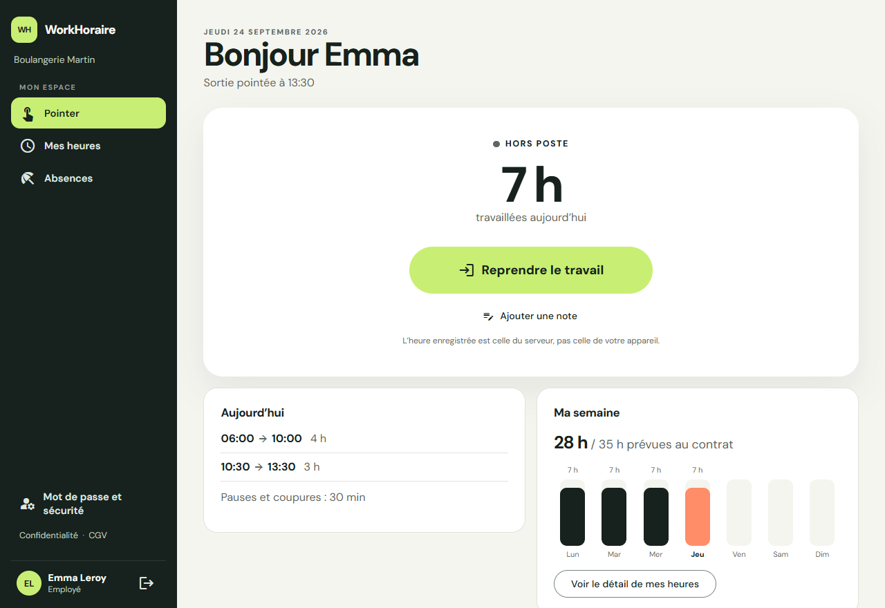
  &nbsp;
  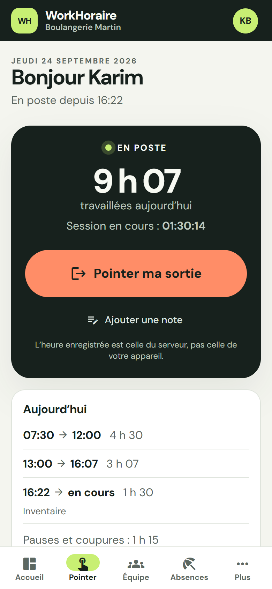
</p>

- **Salariés** : pointer en un geste depuis leur téléphone, voir leur journée et leur semaine, déclarer une sortie oubliée (un e-mail le rappelle au bout de 12 h), poser leurs absences, consulter chaque correction faite sur leurs heures, télécharger toutes leurs données (RGPD).
- **Managers** : tableau de bord de l'équipe, heures par jour et par semaine, corrections tracées avec un motif obligatoire, validation et annulation des absences, alertes légales.
- **Dirigeants** : invitation des salariés par un simple lien, rôles, contrats datés, matricules de paie.
- **Paie** : exports CSV hebdomadaire (heures sup +25/+50 %, heures complémentaires +10/+25 %, absences par type, matricule) et journalier, lisibles directement dans Excel.
- **Abonnement** : gratuit jusqu'à 3 salariés actifs dans le mois, puis 3 € HT par salarié actif, payé par prélèvement SEPA ou carte via Stripe. Un impayé ne bloque jamais le pointage.
- **Site vitrine** (`site/`) : pages prérendues pour le référencement, tarifs avec simulateur, liens d'inscription par offre. Il publie aussi les pages légales : mentions légales, politique de confidentialité, CGV et contrat de sous-traitance RGPD. Les CGV sont acceptées à la création de l'entreprise. L'identité de l'éditeur est à renseigner dans `site/src/app/core/legal/legal-info.json` : le build de production refuse de partir tant qu'il manque un champ obligatoire.

La vision produit, l'étude de marché, le cadre légal, la roadmap et la documentation technique sont dans [`docs/`](docs/README.md). Commencer par la [synthèse](docs/produit/00-synthese.md).

## Aperçu

> Captures réalisées avec des données de démonstration **fictives** : une boulangerie de 6 salariés, sur 3 semaines.

### Suivre l'équipe

| Tableau de bord | Heures de l'équipe |
|---|---|
| 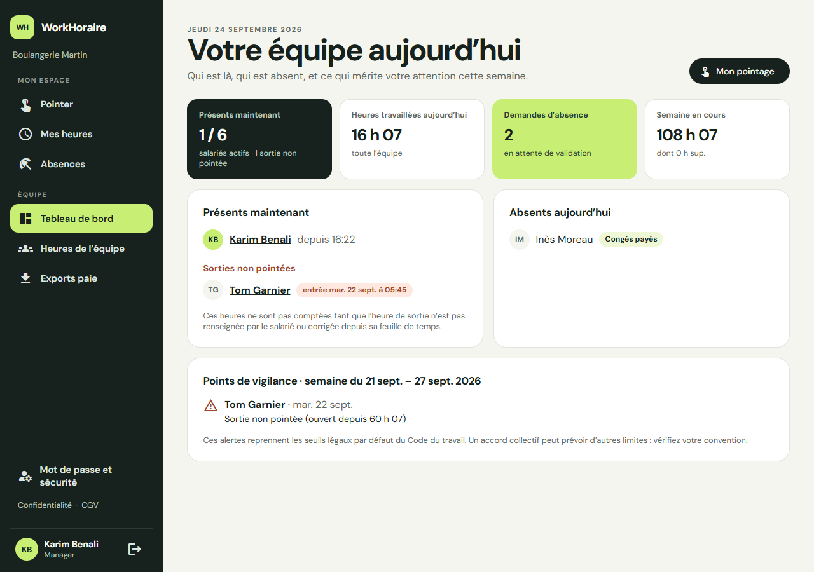 | 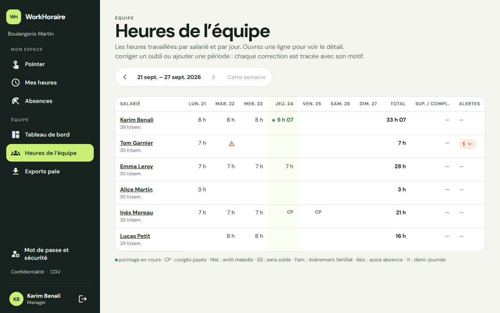 |
| **Feuille de temps et corrections tracées** | **Validation des absences** |
| 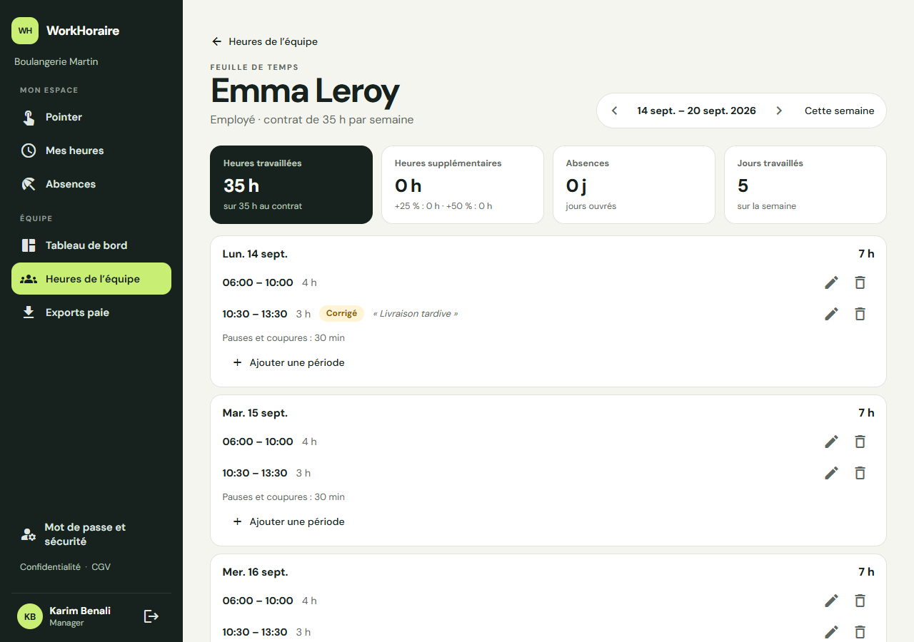 | 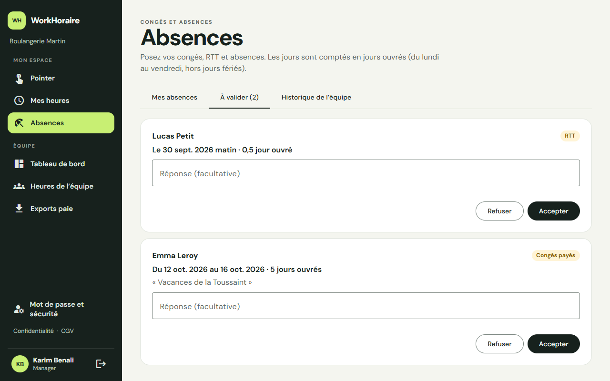 |

### Paie et administration

| Exports pour la paie | Gestion de l'équipe |
|---|---|
| 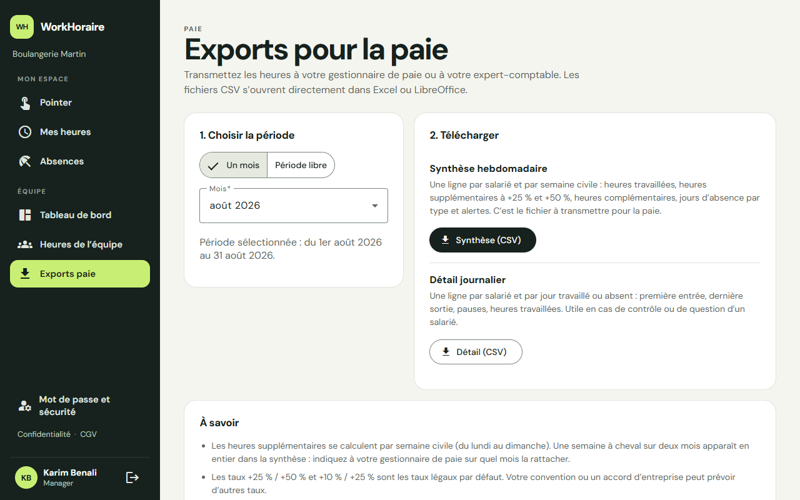 | 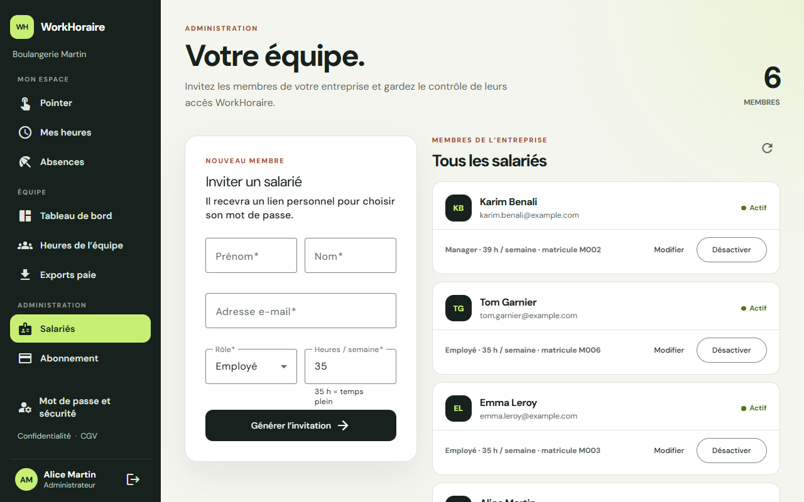 |

### Inviter un salarié : un lien, un mot de passe

L'administrateur génère un lien dans **Salariés** : il part par e-mail à la personne invitée quand un serveur SMTP est configuré, et peut aussi être copié. La personne invitée l'ouvre, voit quelle entreprise l'invite, puis choisit son mot de passe : son adresse est déjà remplie. Elle arrive ensuite directement dans l'entreprise, sur « Pointer ». Un lien perdu se régénère, et l'ancien cesse alors de fonctionner.

| 1. Le lien accueille la personne | 2. Il ne reste que le mot de passe |
|---|---|
| 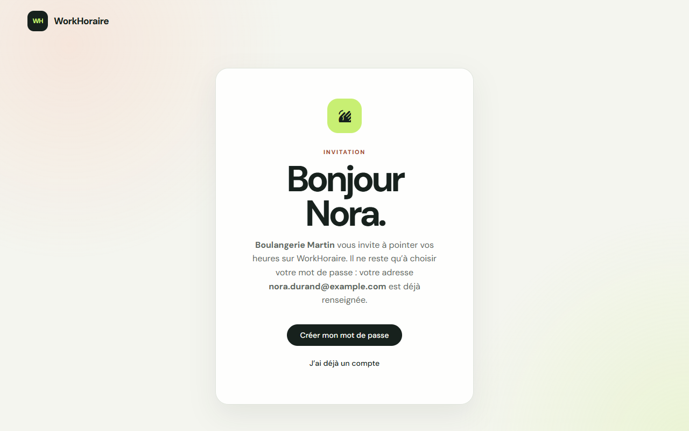 | 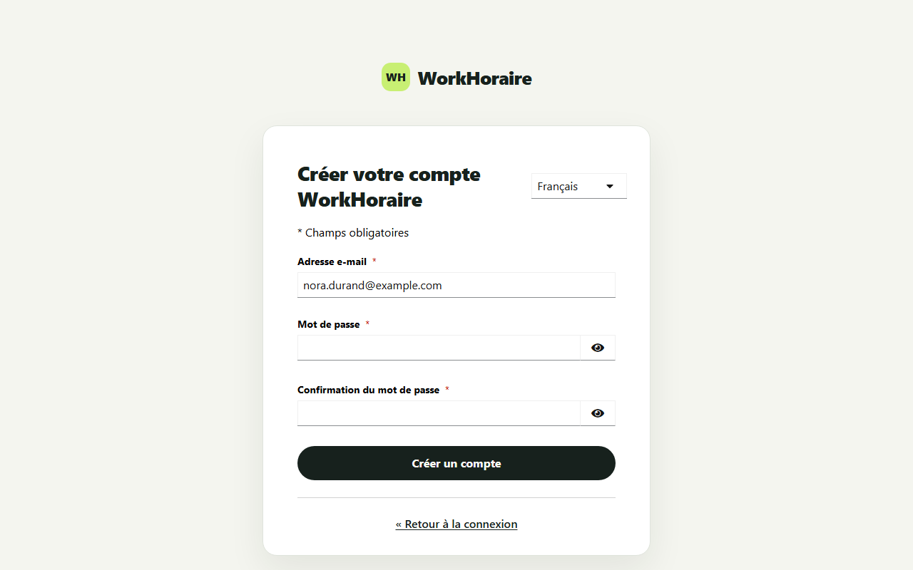 |

### Abonnement

L'administrateur voit ses salariés actifs du mois et le montant estimé. Au-delà de l'offre gratuite, il souscrit en quelques clics sur une page de paiement Stripe. Un impayé fait passer l'entreprise en lecture seule au bout de 30 jours, mais le pointage continue.

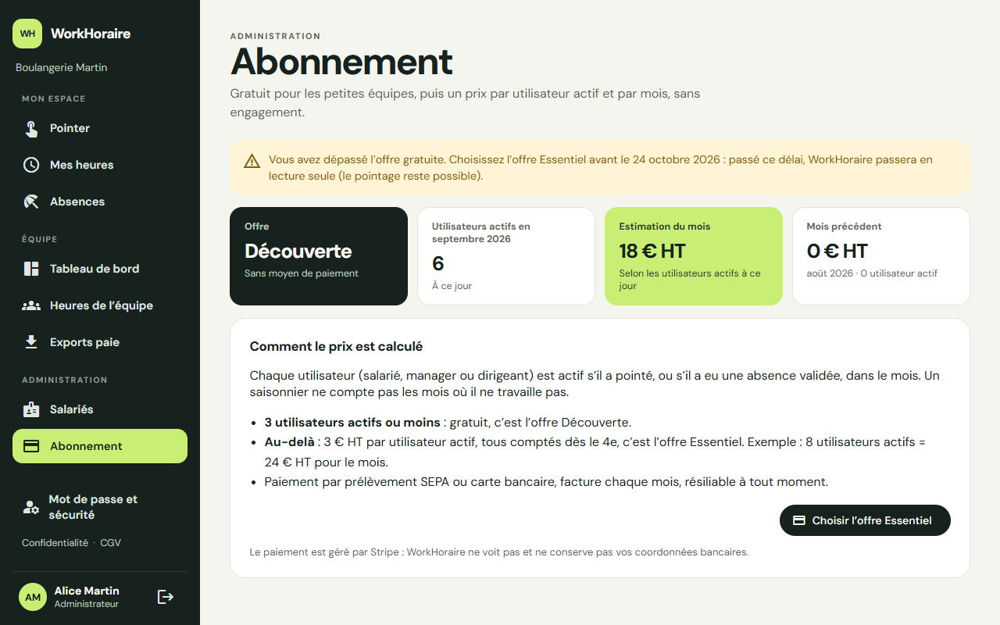

## Stack

Angular 20 (standalone, Material 3) · NestJS 11 · Prisma 6 · PostgreSQL 16 · Keycloak 26 · Docker Compose · Caddy (HTTPS) · Stripe (paiement) · Mailpit (e-mails en local). Les règles de développement sont dans [AGENTS.md](AGENTS.md).

| Dossier | Contenu |
|---|---|
| `backend/` | API NestJS et schéma Prisma |
| `frontend/` | Application Angular (salariés, managers, administrateurs) |
| `site/` | Site vitrine Angular, prérendu en HTML statique |
| `infrastructure/` | Keycloak (realm, thème, image), Caddy, sauvegardes, PostgreSQL, scripts du serveur (`server/` : préparation, déploiement) |
| `docs/` | Produit, marché, cadre légal, architecture, exploitation |
| `.github/` | Intégration continue, déploiement depuis GitHub, Dependabot |
| `docker-compose.yml` | Pile locale : PostgreSQL, Keycloak, Mailpit, joignables depuis cette machine seulement (`127.0.0.1`) |
| `docker-compose.prod.yml`, `docker-compose.prod.local.yml` | Pile de production, et sa répétition en local |
| `.env.example`, `.env.production.example` | Modèles de configuration, local et production |

## Prérequis

- Docker, avec Docker Compose v2 (commande `docker compose`).
- Node.js 24, la version de la CI et des images Docker. Les scripts npm de l'API utilisent `node --env-file`.
- Chrome ou Chromium, pour les tests de l'application et du site (Karma).

## Démarrage rapide

```bash
cp .env.example .env            # puis remplacer les valeurs entre < > (mots de passe, administrateur Keycloak)
docker compose up -d postgres keycloak mailpit
# attendre que Keycloak réponde sur http://localhost:8180
node infrastructure/keycloak/apply-realm-settings.mjs
```

Le script envoie les e-mails de Keycloak vers Mailpit. Le realm exige la vérification des adresses : sans lui, aucune inscription n'aboutit en local. Lancez-le une fois Keycloak démarré : sinon, il échoue.

Dans un premier terminal, lancez l'API :

```bash
cd backend && npm install && npm run prisma:migrate:deploy && npm run start:dev
```

Dans un second terminal, lancez l'application :

```bash
cd frontend && npm install && npm start
```

- API : `http://localhost:3000` (santé : `GET /health`).
- Application : `http://localhost:4200`.
- Keycloak : `http://localhost:8180`.
- Mailpit : `http://localhost:8025`. Les e-mails envoyés en local (invitations, corrections, facturation) y arrivent, et aucun ne part sur Internet.
- Site vitrine (facultatif) : `cd site && npm install && npm start`, puis `http://localhost:4400`.

Sur la page de connexion, **« Enregistrement »** crée un compte : seuls l'e-mail et le mot de passe sont demandés. Au premier accès, vous créez l'entreprise (avec votre prénom et votre nom) et vous en devenez l'administrateur. Vos salariés rejoignent ensuite l'entreprise par le lien d'invitation.

> Si le port 5432 est déjà occupé sur votre machine, changez `POSTGRES_PORT` dans `.env` et reportez le port dans `DATABASE_URL` et `E2E_DATABASE_URL`.

> Votre Keycloak a été créé avant la configuration actuelle du realm ? Relancez `node infrastructure/keycloak/apply-realm-settings.mjs` : il reporte les réglages du realm (voir [Partage du realm](#partage-du-realm)).

## Configuration

Le `.env` à la racine est la source unique de configuration pour Docker, NestJS et Prisma. Il est ignoré par Git ; ne créez pas de second fichier de configuration dans `backend/`. Variables notables :

| Variable | Rôle |
|---|---|
| `DATABASE_URL` | Base applicative |
| `E2E_DATABASE_URL` | Base dédiée aux tests e2e, **vidée à chaque exécution** (son nom doit finir par `_e2e`) |
| `FRONTEND_URL` | Adresse de l'application : origine autorisée par CORS, liens des e-mails, retours de la page de paiement Stripe |
| `KEYCLOAK_*` | Serveur, realm et client de l'API ; compte administrateur de Keycloak |
| `KEYCLOAK_REQUIRE_VERIFIED_EMAIL` | Exige une adresse vérifiée par Keycloak pour accepter une invitation et pour créer une entreprise. `true` par défaut, et en local aussi : Keycloak envoie ses e-mails de vérification à Mailpit. L'API refuse de démarrer avec `false` si `NODE_ENV=production` |
| `SMTP_*`, `MAIL_FROM` | Envoi des e-mails de l'API (Mailpit en local). Sans `SMTP_HOST`, rien n'est envoyé et le lien d'invitation reste à copier |
| `KEYCLOAK_SMTP_*`, `KEYCLOAK_VERIFY_EMAIL` | E-mails de Keycloak et vérification des adresses, appliqués par `apply-realm-settings.mjs` |
| `STRIPE_*` | Paiement en ligne. Vides : paiement coupé, et aucune entreprise n'est bloquée. Voir [exploitation.md](docs/technique/exploitation.md#4-paiement-en-ligne-stripe) |
| `THROTTLE_LIMIT_PER_MINUTE`, `TRUST_PROXY` | Limite de requêtes par adresse IP ; adresse du client lue derrière le proxy HTTPS |

La configuration publique du frontend (URL de l'API, realm et client Keycloak) est dans `frontend/src/environments/environment.ts`.

## Tests

```bash
cd backend && npm test               # unitaires (moteur de calcul, services, DTO)
cd backend && npm run test:e2e       # API complète sur une vraie base PostgreSQL (voir docs/technique/tests-et-qualite.md)
cd frontend && npx ng test --watch=false --browsers=ChromeHeadless
cd site && npx ng test --watch=false --browsers=ChromeHeadless
```

Au 24/09/2026 : 145 tests unitaires backend, 20 tests e2e, 75 tests frontend et 65 tests du site, tous au vert. Les tests e2e couvrent notamment :
- l'authentification (jeton invalide refusé, routes d'administration de l'adaptateur Keycloak absentes) ;
- la concurrence et l'isolation entre entreprises ;
- la chaîne complète d'ajout d'un salarié ;
- la facturation (webhooks Stripe signés, rejoués ou en échec, lecture seule, déclaration mensuelle) ;
- le rappel de sortie oubliée ;
- l'export des données personnelles.

La CI GitHub Actions lance ces tests, vérifie l'infrastructure (fichiers Compose, scripts shell, configurations Caddy, workflows) et construit les images Docker sur chaque pull request et sur `main`. Le détail, les défauts trouvés en revue et le scénario de recette manuelle sont dans [docs/technique/tests-et-qualite.md](docs/technique/tests-et-qualite.md).

## Base de données

Les changements de schéma passent par des migrations Prisma (`backend/prisma/migrations`) :

```bash
cd backend
npm run prisma:validate
npm run prisma:migrate          # en développement : crée et applique une migration
npm run prisma:migrate:deploy   # applique les migrations existantes
```

Des contraintes `CHECK` complètent le schéma Prisma : une période se termine après son début, il y a un seul pointage ouvert par salarié, les dates d'absence sont cohérentes, et un changement de contrat prend effet un lundi. Voir [docs/technique/architecture.md](docs/technique/architecture.md).

## Utilisateurs, rôles et entreprises

- `GET /me` ne repose pas seulement sur les claims Keycloak. Le `sub` du jeton doit correspondre à `User.keycloakSubject` en base, et cet utilisateur doit être actif et rattaché à une `Company`. Une identité Keycloak inconnue est refusée (`403`), et un salarié désactivé voit une page qui le lui explique.
- Le rôle applicatif (`ADMIN`, `MANAGER` ou `EMPLOYEE`) est géré en base, pas par les rôles du realm Keycloak.
- Toutes les opérations utilisent l'entreprise de l'utilisateur authentifié : le frontend ne fournit jamais de `companyId`.
- **Invitations** : l'administrateur génère un lien valable 7 jours. Il part par e-mail au salarié quand un serveur SMTP est configuré, et peut aussi être copié. Le lien ouvre une page d'accueil, puis l'inscription Keycloak avec l'adresse préremplie. Le mot de passe est saisi et géré par Keycloak, jamais par WorkHoraire. Le prénom, le nom, le rôle et le contrat viennent de l'invitation. Voir l'[ADR 0004](docs/technique/adr/0004-inscription-libre-et-email-verifie.md).

La liste complète des routes est dans [docs/technique/api.md](docs/technique/api.md).

## Keycloak local

Keycloak importe le realm `workhoraire` depuis `infrastructure/keycloak/realms/workhoraire-realm.json`. Ses réglages :
- inscription ouverte ;
- pages de connexion en français, aux couleurs de WorkHoraire (thème `infrastructure/keycloak/themes/workhoraire`) ;
- protection anti-brute-force ;
- « Rester connecté » pendant 30 jours au plus ;
- profil utilisateur réduit : l'inscription ne demande que l'e-mail et le mot de passe.

- Le backend utilise le client *bearer-only* `workhoraire-api`.
- Le client public `workhoraire-web` sert à l'application Angular (Authorization Code + PKCE) et ajoute `workhoraire-api` comme audience des jetons.
- La console d'administration utilise `KEYCLOAK_ADMIN` et `KEYCLOAK_ADMIN_PASSWORD` du fichier `.env`.

### Partage du realm

Le fichier versionné est un export de configuration sans utilisateurs ni secret de production. **Un realm n'est importé qu'à sa première création.** Deux possibilités pour un Keycloak déjà créé :

- Pour reporter les réglages du realm sans perdre les comptes, lancez `node infrastructure/keycloak/apply-realm-settings.mjs`. Il applique sept réglages :
  - le profil utilisateur (inscription par e-mail et mot de passe) ;
  - le serveur SMTP de Keycloak, si `KEYCLOAK_SMTP_HOST` est renseigné (Mailpit en local) ;
  - la vérification des e-mails, selon `KEYCLOAK_VERIFY_EMAIL` ;
  - le thème des pages de connexion ;
  - la durée de « Rester connecté » (14 jours sans activité, 30 jours au plus) ;
  - le journal des connexions, conservé 180 jours ;
  - le refus de la connexion directe par mot de passe au client `admin-cli` du realm.

  Ajoutez `--dry-run` pour un essai à blanc. Le script utilise le compte administrateur du `.env`.
- Pour repartir d'une configuration propre en local :

  ```bash
  docker compose down -v
  docker compose up -d postgres keycloak
  ```

  La commande `down -v` supprime les données locales PostgreSQL. Ne l'utilisez pas sur un environnement partagé ou de production.

Pour exporter une configuration mise à jour sans exporter les utilisateurs :

```bash
mkdir -p infrastructure/keycloak/exports
docker compose stop keycloak
docker compose run --rm --no-deps \
  -v "$PWD/infrastructure/keycloak/exports:/tmp/realm-export" \
  keycloak export --dir /tmp/realm-export --realm workhoraire --users skip
docker compose start keycloak
```

Vérifiez l'export et retirez toute donnée sensible avant de mettre à jour `infrastructure/keycloak/realms/workhoraire-realm.json`. Le dossier `infrastructure/keycloak/exports/` est ignoré par Git, car un export peut contenir des utilisateurs ou des secrets.

## Mise en production

`docker-compose.prod.yml` décrit la pile complète sur un serveur : proxy Caddy (HTTPS automatique, en-têtes de sécurité, CSP), site vitrine, application, API, migrations, Keycloak (console d'administration fermée au public) et sauvegardes chiffrées chaque nuit. Le guide pas à pas (installation, Keycloak, Stripe, sauvegardes, mises à jour, surveillance) est [docs/technique/exploitation.md](docs/technique/exploitation.md). L'architecture est décrite dans l'[ADR 0008](docs/technique/adr/0008-architecture-de-production.md).

Suivre aussi la checklist de [docs/technique/securite-et-rgpd.md](docs/technique/securite-et-rgpd.md) : vérification des e-mails avec SMTP, MFA des administrateurs, hébergement dans l'UE, contrat de sous-traitance RGPD.

## Contribuer

- Les règles de développement (architecture, sécurité, isolation des entreprises, base de données, tests, Git) sont dans [AGENTS.md](AGENTS.md) ; [CLAUDE.md](CLAUDE.md) y renvoie.
- Chaque pull request passe par la CI ([.github/workflows/ci.yml](.github/workflows/ci.yml)) : tests unitaires et e2e de l'API, tests de l'application et du site, vérification de l'infrastructure, builds et images Docker.
- Un changement de schéma passe toujours par une migration Prisma (voir [Base de données](#base-de-données)).
- L'état daté du produit (fait, ensuite) est tenu dans la [roadmap](docs/produit/06-roadmap.md) : la mettre à jour avec chaque livraison.
