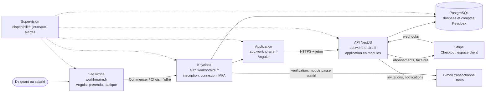
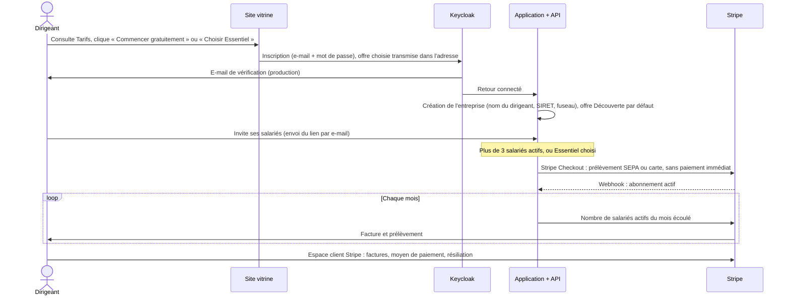

# Architecture cible : site vitrine, inscription, facturation et production

> Proposition du 24/09/2026. Elle complète [architecture.md](architecture.md), qui décrit l'application actuelle, et s'appuie sur les prix et les étapes d'hébergement de [../produit/08-prix-et-hebergement.md](../produit/08-prix-et-hebergement.md). Elle respecte AGENTS.md : Angular, NestJS, PostgreSQL, Keycloak, Docker, et une application organisée en modules, sans microservices. Décision détaillée : [ADR 0008](adr/0008-architecture-de-production.md).

## 1. Objectifs

| Exigence | Pilotes | Lancement | Croissance |
|---|---|---|---|
| Disponibilité visée | 99 % (environ 7 h 18 d'arrêt par mois) | 99,5 % (environ 3 h 39) | 99,9 % (environ 44 min) |
| Données perdues au pire (RPO) | 24 h | 24 h, puis 1 h | 1 h ou moins |
| Temps de remise en service (RTO) | 4 h | 2 h | 30 min |
| Hébergement | 1 VPS OVHcloud | Instance Scaleway et PostgreSQL géré | Base doublée, 2 instances derrière un répartiteur de charge |

Toutes les données sont hébergées en France, chez des fournisseurs européens. Les relevés d'heures sont des données salariales : leur sauvegarde, et un test de restauration réussi, passent avant tout le reste.

## 2. Vue d'ensemble

Les noms de domaine sont des exemples, à réserver.

**Pourquoi des sous-domaines séparés** : le site vitrine, l'application et Keycloak se déploient indépendamment. Les cookies de Keycloak restent isolés, et le site peut être mis en cache sans risque.

## 3. Le parcours client, du site à la facture

Les règles métier du parcours :
- **Sans carte bancaire** pour commencer. L'offre Découverte est gratuite jusqu'à 3 salariés actifs, un salarié actif étant un salarié qui a pointé ou posé une absence dans le mois.
- **Passage à Essentiel** : dès le 4e salarié actif, l'administrateur est invité à ajouter un moyen de paiement, avec 30 jours pour le faire. Rien n'est bloqué pendant ce délai.
- **Impayé** : relances par Stripe, puis **lecture seule** au bout de 30 jours. Les heures restent consultables et exportables, car l'employeur doit pouvoir produire ses relevés. Aucune donnée n'est supprimée.
- **Prix** : une facturation à l'usage, avec un compteur Stripe (somme) et un prix de 3 € par unité. WorkHoraire applique lui-même le seuil gratuit : il ne déclare jamais un mois de 3 salariés actifs ou moins. Un prix « par niveaux » en mode volume aurait aussi convenu. Nous l'avons écarté pour qu'un éventuel cumul de deux mois sur une même période Stripe reste juste. Mise en œuvre et réglages : [exploitation.md](exploitation.md#4-paiement-en-ligne-stripe).

## 4. Composants

### 4.1 Site vitrine (nouveau dossier `site/`)

- **Angular prérendu** : les pages sont générées en HTML statique au moment du build. Le référencement est bon, le site est rapide, il n'y a pas de serveur à maintenir et c'est la même technologie que l'application.
- **Pages** :
  - accueil ;
  - fonctionnalités par métier (restauration, commerce, artisans) ;
  - **tarifs**, avec un simulateur « combien pour N salariés » ;
  - sécurité et RGPD (hébergement en France, contrat de sous-traitance) ;
  - guides, pour le référencement (« calcul des heures supplémentaires », « feuille d'heures », « sortir d'Excel ») ;
  - contact ;
  - pages légales : mentions légales, CGV, confidentialité, contrat de sous-traitance.
- **Aucun cookie ni traceur tiers**, donc pas de bandeau cookies. La mesure d'audience se fait sans cookie et est hébergée dans l'UE (doc 04).
- **Boutons d'action** vers `app.workhoraire.fr/inscription?offre=decouverte` ou `?offre=essentiel`.

### 4.2 Application et API (existantes, complétées)

L'application reste organisée en modules NestJS, dans un seul programme. Trois nouveaux modules :

| Module | Rôle |
|---|---|
| `billing` | Client et abonnement Stripe par entreprise ; webhooks signés et traités une seule fois ; comptage mensuel des salariés actifs ; limites de l'offre gratuite ; lecture seule en cas d'impayé |
| `notifications` | Envoi des e-mails via Brevo : invitation (le lien part par e-mail au lieu d'être copié), correction faite sur mes heures, rappel de sortie oubliée |
| `jobs` | Tâches planifiées (comptage mensuel, purge des données au-delà de la durée de conservation, rappels). Un verrou PostgreSQL garantit qu'une seule instance les exécute, même avec plusieurs instances |

Nouvelles tables :
- `Subscription` : entreprise, identifiants Stripe, offre, statut, fin de période ;
- `BillingUsage` : entreprise, mois, nombre de salariés actifs, date d'envoi à Stripe ;
- `ProcessedWebhook` : garantit qu'un webhook n'est traité qu'une fois.

**Envoyer l'invitation par e-mail** simplifie le parcours, et prouve en plus que la personne possède bien l'adresse.

### 4.3 Keycloak

- Thème de connexion aux couleurs de WorkHoraire.
- SMTP configuré, vérification des e-mails active.
- **MFA obligatoire pour les administrateurs**.
- Profil utilisateur réduit (e-mail et mot de passe), déjà en place.
- À l'étape croissance : 2 instances en cluster.

### 4.4 Données

- PostgreSQL 16, avec un schéma pour WorkHoraire et un pour Keycloak.
- L'application se connecte avec un utilisateur **sans droit de modifier le schéma**. Les migrations Prisma utilisent un autre utilisateur, dans la chaîne de déploiement.
- Migrations compatibles avec la version précédente de l'application (on ajoute, puis on retire), pour déployer sans interruption.

## 5. Environnements et déploiement

| Environnement | Contenu | Données |
|---|---|---|
| Local | Docker Compose actuel | Données fictives |
| Préproduction | Copie de la production, plus petite | Données fictives, jamais de données clients |
| Production | Selon l'étape (§ 1) | Clients |

**Intégration et déploiement continus avec GitHub Actions** :
1. À chaque pull request : tests unitaires, tests e2e sur un PostgreSQL de test, build, vérification des dépendances.
2. Après la fusion dans `main` : images Docker (API, application, site), déploiement automatique en préproduction.
3. Pour la production, sur validation manuelle : sauvegarde, `prisma migrate deploy`, puis bascule vers les nouvelles images. **Retour arrière** : redéploiement des images précédentes.

## 6. Robustesse par étape

| Point de défaillance | Pilotes | Lancement | Croissance |
|---|---|---|---|
| Serveur applicatif | Un VPS : reconstruction scriptée depuis les sauvegardes | Une instance, et reconstruction scriptée | 2 instances derrière un répartiteur de charge |
| Base de données | Dump quotidien chiffré, copié hors du serveur | Base gérée avec sauvegardes automatiques, plus un dump quotidien exporté | Nœud de secours et restauration à un instant donné |
| Keycloak | Sur le VPS | Sur l'instance | 2 instances en cluster |
| Déploiements | Courte interruption | Courte interruption, annoncée | Sans interruption |
| **Test de restauration** | **Mensuel** | **Mensuel** | **Mensuel** |

## 7. Supervision et sécurité

- **Disponibilité** : l'API expose déjà `/health`. Une sonde extérieure la vérifie chaque minute, et une **page de statut publique** informe les clients.
- **Journaux et métriques** : journaux structurés, temps de réponse, erreurs 5xx, mémoire de Keycloak. Des alertes partent par e-mail. Les outils peuvent être auto-hébergés et libres (par exemple Uptime Kuma, Grafana, Loki, Prometheus), pour garder les données en France.
- **Sécurité** : suivre la checklist de [securite-et-rgpd.md](securite-et-rgpd.md). Notamment :
  - HTTPS partout, en-têtes HSTS et CSP ;
  - limite de requêtes sur l'API et la connexion ;
  - secrets hors du dépôt ;
  - analyse des dépendances et des images ;
  - sauvegardes chiffrées ;
  - **test d'intrusion avant l'ouverture au public**.
- **RGPD** : contrat de sous-traitance proposé sur le site, registre, purge automatique au-delà de la durée de conservation.

## 8. Plan de réalisation

| Lot | Contenu | Effort estimé |
|---|---|---|
| 0. Production pilote | Dockerfiles, `docker-compose.prod.yml` avec Caddy (HTTPS), noms de domaine, SMTP Brevo et vérification des e-mails, sauvegardes et test de restauration, sonde de disponibilité, GitHub Actions (tests et build) | 1 semaine |
| 1. Site vitrine | `site/` en Angular prérendu : accueil, tarifs et simulateur, fonctionnalités, sécurité, pages légales, plan du site pour le référencement | 1 à 2 semaines |
| 2. Facturation | Module `billing`, prix Stripe au volume, Checkout, espace client, webhooks, comptage mensuel, limites de l'offre gratuite, lecture seule, page « Abonnement », CGV | 2 semaines |
| 3. E-mails | Module `notifications` : invitations envoyées par la plateforme, notifications de correction, rappels de sortie oubliée | 1 semaine |
| 4. Lancement | Passage à Scaleway (base gérée), préproduction, déploiement continu, journaux, métriques, alertes et page de statut | 1 semaine |
| 5. Obligations | Facture électronique via une plateforme agréée, **avant le 1er septembre 2027** | À planifier |
| 6. Croissance | Nœud de secours pour la base, 2 instances de l'API et de Keycloak, déploiement sans interruption, test d'intrusion | Selon la croissance |

Les efforts sont des estimations de l'équipe pour un ou deux développeurs. Elles sont à affiner au découpage des tâches.

**Avancement au 24/09/2026.** Tout ce qui ne demande ni serveur ni compte externe est fait et testé :

- **Lot 0** : images Docker, `docker-compose.prod.yml` avec Caddy, sauvegardes chiffrées avec test de restauration, GitHub Actions et Dependabot. La pile complète a été répétée en local en HTTPS.
- **Lot 1** : site vitrine dans `site/`.
- **Lot 2** : module `billing`, page « Abonnement », parcours `/inscription?offre=…`. Le paiement est prêt, mais coupé tant que les clés Stripe ne sont pas renseignées.
- **Lot 3** : e-mails d'invitation, de correction et de dépassement de l'offre gratuite.

**Reste à faire** : les noms de domaine, le serveur, les comptes Brevo et Stripe, et la validation de Stripe en mode test. Il faut aussi les textes légaux (champs « [À compléter] » du site), la copie des sauvegardes hors du serveur, le rappel de sortie oubliée, l'offre annuelle et le lot 4. La marche à suivre est dans [exploitation.md](exploitation.md).
