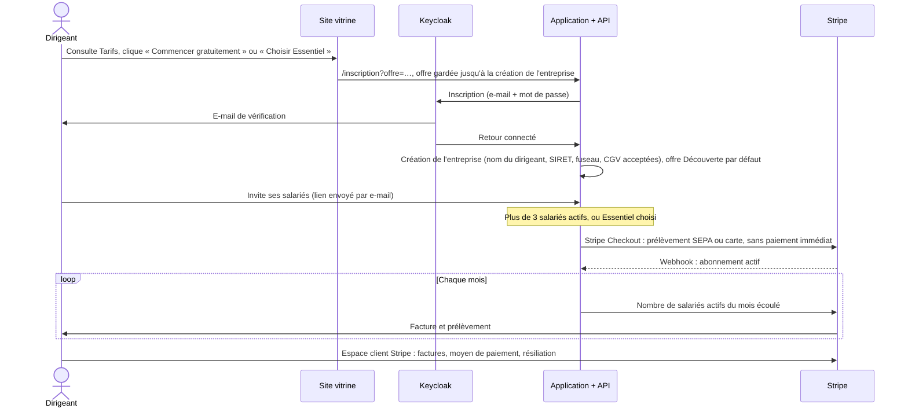

# Architecture

L'architecture suit [AGENTS.md](../../AGENTS.md) : un monolithe modulaire (Angular, NestJS, Prisma, PostgreSQL, Keycloak, Docker), sans nouveau framework ni nouveau service.

Ce document décrit **ce qui est construit**. Les étapes suivantes (lancement, croissance) sont dans [architecture-cible.md](architecture-cible.md), et l'état daté du produit dans la [roadmap](../produit/06-roadmap.md).

```text
Navigateur (Angular 20, mobile d'abord)
   │  OIDC Authorization Code + PKCE          ┌──────────────┐
   ├─────────────────────────────────────────▶│  Keycloak 26 │  comptes, mots de passe,
   │  Bearer access token (audience API)      └──────────────┘  inscription, anti-brute-force
   ▼
NestJS 11 (API REST)
   │  guards : Keycloak → utilisateur applicatif → rôle
   │  services métier (isolation par companyId)
   ▼
Prisma 6 ──▶ PostgreSQL 16 (schéma public ; Keycloak dans le schéma keycloak)
```

Autour de l'API : Stripe pour le paiement de l'abonnement, un serveur SMTP pour les e-mails (Brevo en production, Mailpit en local) et, en production, le proxy Caddy (§ 7).

## 1. Modules backend

| Module | Rôle | Routes |
|---|---|---|
| `auth` | Vérifie le jeton Keycloak, charge l'utilisateur applicatif et son entreprise, contrôle les rôles | `GET /me` |
| `onboarding` | Crée l'entreprise et son premier ADMIN | `POST /onboarding/company` |
| `employees` | Salariés, invitations (lien envoyé aussi par e-mail), contrat, matricule | `/employees`, `/employee-invitations` |
| `time-entries` | Pointage du salarié (`/time-clock`) ; corrections et piste d'audit (`/time-entries`) ; e-mail au salarié pour chaque correction faite par un autre ; rappel des sorties oubliées | voir [api.md](api.md) |
| `timesheets` | Feuilles de temps (moi, équipe, un salarié) ; **moteur de calcul** pur | `/timesheets` |
| `absences` | Demandes, validation, annulation | `/absences` |
| `dashboard` | Vue d'équipe du jour et de la semaine | `GET /dashboard/team` |
| `exports` | CSV pour la paie (hebdomadaire, journalier) | `GET /exports/timesheets` |
| `billing` | Offre et salariés actifs du mois ; Stripe (Checkout, espace client, webhooks signés traités une seule fois) ; lecture seule en cas d'impayé (intercepteur global, 402) ; déclaration mensuelle à Stripe | `/billing` |
| `privacy` | Export de toutes les données de la personne connectée (RGPD, articles 15 et 20) | `GET /me/data-export` |
| `notifications` | Envoi des e-mails par SMTP (`MailService`) ; sans `SMTP_HOST`, rien n'est envoyé et l'application continue de fonctionner | – |
| `health` | Santé de l'API (contrôleur seul) | `GET /health` |
| `common/dates` | Dates locales dans le fuseau de l'entreprise, jours fériés, validation de période | – |
| `common/validation` | Refus des adresses web dans les noms, recopiés dans les e-mails | – |

Chaque module suit le schéma `Controller → Service → Prisma`. Les contrôleurs restent minces, les règles métier sont dans les services, et les calculs dans des fonctions pures testées sans base.

Les tâches planifiées (`@nestjs/schedule`) vivent dans leur module : `BillingJob` (`billing/`, chaque jour à 04:00 UTC) et `ForgottenClockOutJob` (`time-entries/`, toutes les 15 minutes). L'API tourne en une seule instance, sans verrou sur ces tâches : un verrou consultatif PostgreSQL est obligatoire avant d'en lancer une seconde ([ADR 0008](adr/0008-architecture-de-production.md)).

## 2. Modèle de données

```text
Company (nom, SIRET, fuseau ; CGV acceptées : termsAcceptedAt, termsVersion)
Company 1─* User (salarié : rôle, contrat en vigueur, matricule, actif)
Company 1─* ContractPeriod (historique des contrats : durée hebdomadaire, date d'effet un lundi)
Company 1─* EmployeeInvitation (jeton haché, rôle, contrat)
Company 1─* TimeEntry (période de travail : startAt, endAt?, source CLOCK|MANUAL, note, reminderSentAt du rappel de sortie oubliée)
Company 1─* TimeEntryAuditLog (action, motif, avant/après en JSON ; pas de clé étrangère vers TimeEntry)
Company 1─* AbsenceRequest (type, statut, dates, demi-journées, validation)
Company 1─0..1 Subscription (offre DECOUVERTE|ESSENTIEL, statut, identifiants Stripe, début du délai de paiement)
Company 1─* BillingUsage (mois, salariés actifs, montant, date de la déclaration à Stripe)
ProcessedWebhook (identifiant des événements Stripe déjà traités)
```

Aucune donnée de paiement n'est stockée : elles restent chez Stripe, qui ne reçoit jamais l'identité ni les heures des salariés.

Garanties en base (migrations `20260923100000_add_time_tracking_and_absences`, `20260923130000_add_contract_history` et `20260924120000_add_billing`) :

| Garantie | Mécanisme |
|---|---|
| Un seul pointage ouvert par salarié, même en cas de requêtes simultanées | `TimeEntry.openUserId` vaut `userId` tant que la période est ouverte, avec un index unique |
| Cohérence d'une période | `CHECK (endAt > startAt)` ; `CHECK` liant `endAt` nul et `openUserId` renseigné |
| Absences cohérentes | `CHECK (endDate >= startDate)` |
| Contrat plausible | `CHECK (weeklyContractMinutes BETWEEN 60 AND 2880)`, sur `User`, `ContractPeriod` et `EmployeeInvitation` |
| Historique de contrat cohérent | Date d'effet un lundi (`CHECK (EXTRACT(ISODOW FROM "effectiveFrom") = 1)`), une seule période par salarié et par date |
| Matricule unique dans l'entreprise | Index unique `(companyId, payrollId)` |
| La piste d'audit survit à la suppression d'une période | `timeEntryId` sans clé étrangère ; `entryStartAt` sert au filtrage par période |
| Un abonnement par entreprise, un relevé par mois | Index uniques `Subscription.companyId` et `(companyId, month)` sur `BillingUsage` ; `CHECK` : effectifs et montants jamais négatifs |
| Un webhook Stripe n'est appliqué qu'une fois | Identifiant de l'événement en clé primaire de `ProcessedWebhook` |
| Isolation par entreprise | `companyId` sur toutes les tables métier, repris de l'utilisateur authentifié, jamais du client |

Les instants sont stockés en UTC (`timestamp(3)`). Les jours sont calculés dans le fuseau de l'entreprise (`Company.timezone`) avec l'API `Intl` de Node.js, sans dépendance ajoutée (ADR 0003).

## 3. Sécurité applicative

- **Authentification** : Keycloak, via le client public `workhoraire-web` (PKCE). L'API est déclarée *bearer-only* (`workhoraire-api`), et l'audience du jeton est vérifiée.
- **Utilisateur applicatif** : le `sub` du jeton doit correspondre à un `User` actif, rattaché à une entreprise. Le rôle vient de la base, pas de Keycloak. L'adresse e-mail est reprise du jeton dès que Keycloak l'a vérifiée : l'administrateur ne peut pas la changer, et les e-mails partent donc à une adresse prouvée.
- **Autorisation** : `@Roles(...)` et `ApplicationRolesGuard`, plus des règles métier dans les services (le manager ne corrige pas ses propres heures).
- **Entrées** : `ValidationPipe` global en liste blanche, qui refuse les champs inconnus. Les instants doivent être au format ISO 8601 **avec fuseau**. Les dates d'une période sont validées et les périodes limitées à 93 jours (62 pour les exports). Les noms refusent les adresses web.
- **Limite de débit** : `@nestjs/throttler`, 300 requêtes par minute et par adresse IP, 20 par minute pour les invitations. Derrière le proxy, l'adresse du client vient de `X-Forwarded-For` (`TRUST_PROXY`).
- **Lecture seule** : un intercepteur global refuse les modifications (402) d'une entreprise dont l'abonnement est impayé au-delà du délai, sauf le pointage et le paiement (voir [api.md](api.md)).

Détail et checklist de production : [securite-et-rgpd.md](securite-et-rgpd.md).

## 4. Frontend

- Composants **standalone**, signaux, `OnPush`, formulaires réactifs, Angular Material 20 avec un thème **Material 3 aux couleurs de la marque** (`styles.scss`).
- **Mise en page** (`core/layout/shell`) : barre latérale sur ordinateur ; en mobile, barre supérieure et **navigation basse** adaptée au rôle.
- **Routes** chargées à la demande. Les gardes (`authGuard`, `companyGuard`, `managerGuard`, `adminGuard`, `onboardingGuard`, `accountDisabledGuard`, et `homeRedirectGuard`, qui ouvre le tableau de bord pour l'équipe et « Pointer » pour les autres) servent l'ergonomie ; **la sécurité reste côté API**.
- **Pages** :
  - `clock` : pointer ;
  - `my-time` : mes heures, historique des corrections, téléchargement de mes données ;
  - `absences` ;
  - `dashboard` ;
  - `team` et `team/:employeeId` : feuilles de temps et corrections ;
  - `exports` ;
  - `employees` (ADMIN) ;
  - `abonnement` (ADMIN) : offre, salariés actifs, paiement Stripe ;
  - `onboarding` : création de l'entreprise, avec l'acceptation des CGV ;
  - `inscription` : arrivée des liens du site vitrine ; l'offre choisie (`?offre=decouverte` ou `?offre=essentiel`) est gardée jusqu'à la création de l'entreprise (`core/billing/chosen-offer.ts`) ;
  - `employee-invitations/:token` : page d'accueil d'une invitation, sans connexion ;
  - `account-disabled` : compte désactivé.
- **Configuration** : `environment.ts` pour `ng serve` ; en conteneur, `/config.json`, écrit au démarrage à partir des variables `API_URL`, `KEYCLOAK_URL` et `SITE_URL`, le remplace (`core/config/runtime-config.ts`).
- **Composants partagés** (`shared/timesheet`) : navigateur de semaine, résumé de semaine, liste des jours, historique des corrections.
- **Dates** (`core/time/time-format.ts`) : affichage dans le fuseau de l'entreprise, jamais dans celui de l'appareil.
- **Polices auto-hébergées** (`@fontsource-variable/dm-sans`, `material-icons`) : aucun appel à un CDN tiers.

## 5. Flux clés

**Pointer**
1. `POST /time-clock/clock-in` crée une période ouverte, avec `startAt` = heure du serveur et `openUserId` = l'utilisateur.
2. En cas de conflit sur l'index unique, l'API répond 409 « déjà pointé ».
3. `POST /time-clock/clock-out` clôture la période ouverte. La mise à jour est conditionnée à `openUserId` pour éviter une double clôture.

**Corriger**
1. `PATCH /time-entries/:id` avec un motif.
2. Dans une transaction : verrou de la ligne du salarié (`SELECT … FOR UPDATE`), contrôle de chevauchement, mise à jour conditionnée à la version lue (`updatedAt`, sinon 409), puis écriture de `TimeEntryAuditLog` (avant/après).
3. Les demandes d'absence (création, validation) prennent le même verrou : deux demandes simultanées ne peuvent pas se chevaucher.

**Inviter**
1. L'ADMIN crée l'invitation (`POST /employees/invitations`). Le lien part par e-mail quand un serveur SMTP est configuré, et peut aussi être copié.
2. Le lien ouvre une page d'accueil sans connexion (Keycloak en mode `check-sso` sur ces URL), qui lit l'aperçu public de l'invitation.
3. « Créer mon mot de passe » ouvre l'inscription Keycloak, adresse préremplie. Au retour, `POST /employee-invitations/:token/accept` rattache le compte à l'entreprise.

**Exporter**
1. `GET /exports/timesheets?granularity=week` calcule les feuilles de l'équipe sur des semaines complètes.
2. Le CSV est produit en UTF-8 avec BOM, séparé par `;`, protégé contre l'injection de formules.

**Rappeler une sortie oubliée**
1. Toutes les 15 minutes, `ForgottenClockOutJob` cherche les pointages ouverts depuis plus de 12 h qui n'ont pas encore eu de rappel.
2. Il renseigne `reminderSentAt`, puis envoie l'e-mail au salarié : un seul rappel par pointage, et aucun si l'envoi d'e-mails n'est pas configuré.

**Télécharger mes données**
1. `GET /me/data-export` lit, dans l'entreprise de la personne connectée, ses seules données : profil, contrats, pointages, absences et corrections.
2. Le fichier JSON est renvoyé en pièce jointe, sans mise en cache.

**S'abonner, du site à la facture**



Le prix est facturé à l'usage : un compteur Stripe (somme) et un prix de 3 € par unité. WorkHoraire applique lui-même le seuil gratuit : il ne déclare jamais un mois de 3 salariés actifs ou moins. Un prix « par niveaux » en mode volume aurait aussi convenu ; il a été écarté pour qu'un éventuel cumul de deux mois sur une même période Stripe reste juste.

Les règles (salarié actif, délai de 30 jours, lecture seule, déclaration mensuelle, webhooks) et les réglages du compte Stripe sont dans [exploitation.md](exploitation.md#4-paiement-en-ligne-stripe). Sans clés Stripe, le paiement est coupé et aucune entreprise ne passe en lecture seule.

## 6. Environnement local

- `docker compose up -d postgres keycloak`. Le realm est importé à la **première** création de la base Keycloak.
- Sur un Keycloak déjà créé, il faut reporter les réglages du realm : lancer `node infrastructure/keycloak/apply-realm-settings.mjs` (options `--dry-run` pour un essai à blanc, `--env-file` pour un autre fichier que `.env`). La liste des réglages appliqués est dans le [README](../../README.md#partage-du-realm). Le script lit le compte administrateur dans ce fichier et appelle l'API d'administration Keycloak.
- `docker compose up -d mailpit` : les e-mails de l'API et de Keycloak arrivent dans Mailpit (`http://localhost:8025`).
- Le thème des pages de connexion (`infrastructure/keycloak/themes/workhoraire`) est monté dans le Keycloak de développement. `start-dev` ne met pas les thèmes en cache : une modification du CSS se voit en rechargeant la page. Le script `apply-realm-settings.mjs` active le thème sur un realm existant.
- La base `workhoraire_e2e`, dédiée aux tests e2e, est créée par `infrastructure/postgres/init/02-e2e-database.sql`, mais seulement pour un volume neuf.
- Le `.env` à la racine est la source unique de configuration (voir `.env.example`). Si le port 5432 est déjà pris, changez `POSTGRES_PORT`, `DATABASE_URL` et `E2E_DATABASE_URL`.

## 7. Site vitrine et production

- **Site vitrine** (`site/`) : application Angular distincte, prérendue en HTML statique au build, servie comme des fichiers. Pages : accueil, fonctionnalités, tarifs avec simulateur, sécurité, guides (heures supplémentaires, information des salariés), mentions légales, confidentialité, CGV et contrat de sous-traitance. Ni cookie ni traceur. Les boutons d'inscription mènent à `/inscription?offre=decouverte` ou `?offre=essentiel` de l'application. Détails : [site/README.md](../../site/README.md).
- **Production** (`docker-compose.prod.yml`, un seul serveur) : proxy Caddy (HTTPS, en-têtes de sécurité, CSP, journal d'accès), site, application, API, migrations, Keycloak (console d'administration fermée au public), PostgreSQL et sauvegardes chiffrées chaque nuit. Dans la base, trois rôles : le propriétaire migre et sauvegarde, Keycloak possède son schéma, l'API lit et écrit les données sans pouvoir modifier le schéma.
- Mise en ligne, mises à jour et sauvegardes : [exploitation.md](exploitation.md). Décision : [ADR 0008](adr/0008-architecture-de-production.md). Étapes suivantes (base gérée, préproduction, haute disponibilité) : [architecture-cible.md](architecture-cible.md).
